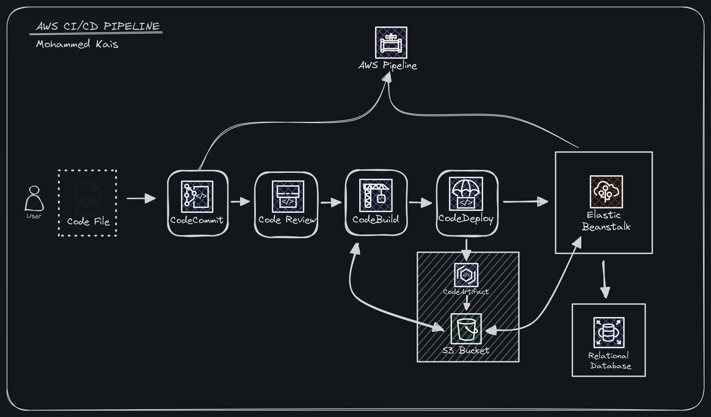

# CICD_using_complete_AWS_resources

This is a complete Continious Integration and Continious Delivery(CICD) usinf complete services of Amazon-web Services(AWS)
where any changes done in code will be detected and code changed will be triggered by AWS pipeline and commits changes and reconstructs.

**Services Used**:

- AWS Pipeline
- Come Commit
- Code Build
- Code deploy
- S3 Bucket
- Elastic Beanstalk
- Relational Database(RDS)

## Services Explanation
**Come Commit:** To store the Source code 
**Code Build:** To build the Artifact and Analysis 
**Code Deploy :** Deploy Artifact to varios targets, here our target being EBS 
**Elastic Beanstalk:** Platform to run Tomcat Services 
**RDS:** used as a Database 

## Author
- Twitter: [@kaissssssss08](https://twitter.com/kaissssssss08)
- LinkedIn:[mohdkais](https://www.linkedin.com/in/mohdkais/)
- Portfoli:[kaiswork.shop](https://www.kaiswork.shop)
